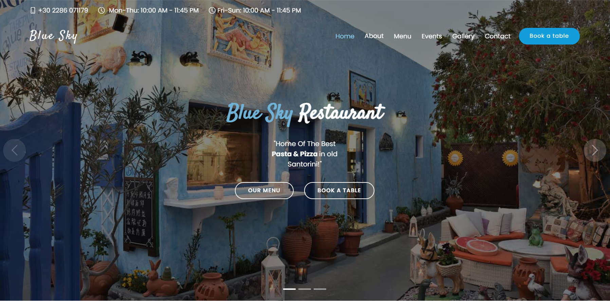

[Blue Sky Restaurant](https://github.com/Anubhav990/bluesky-restaurant-santorini) is a simple, modern and responsive website for restaurants, made with Bootstrap.

<!-- some description about my project -->
Blue Sky Restaurant is a stunning and contemporary restaurant website based on a famous old school restaurant in Oia old Santorini, Greece, designed using Bootstrap for a modern and responsive experience. Meticulous research and thoughtful modifications of basic templates have transformed this project into something truly remarkable. Following the DRY (Don't Repeat Yourself) principle, code duplication has been eliminated, resulting in a more efficient and maintainable codebase.

# Live Preview:

Link:  https://bluesky-restaurant-santorini.vercel.app/

# Install

- Clone the repository:

```bash
git clone https://github.com/Anubhav990/bluesky-restaurant-santorini.git
```

- Open **`index.html`** in your browser, and enjoy !

# Used libraries

- JavaScript
- CSS
- Bootstrap5
- Bootstrap-icons
- Swiper
- Isotope
- Animate.css

## Todos

- [ ] Implement back-end project for food ordering, delivery, and booking tables.
